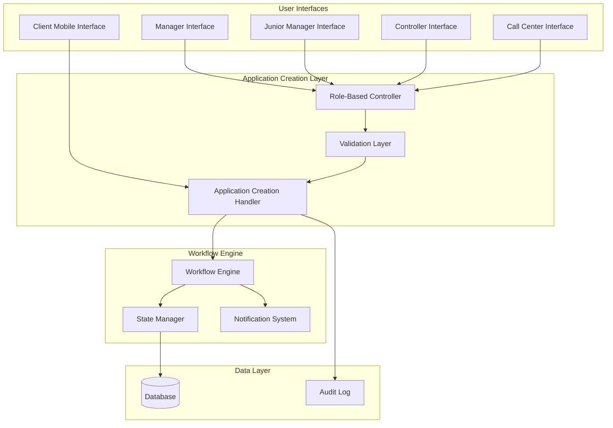
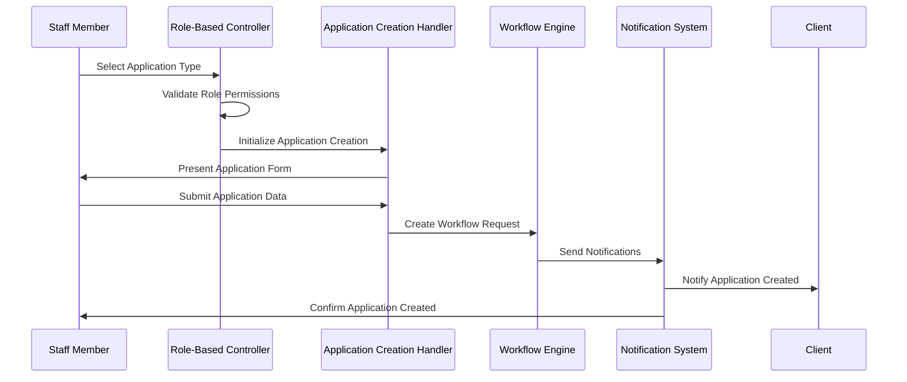
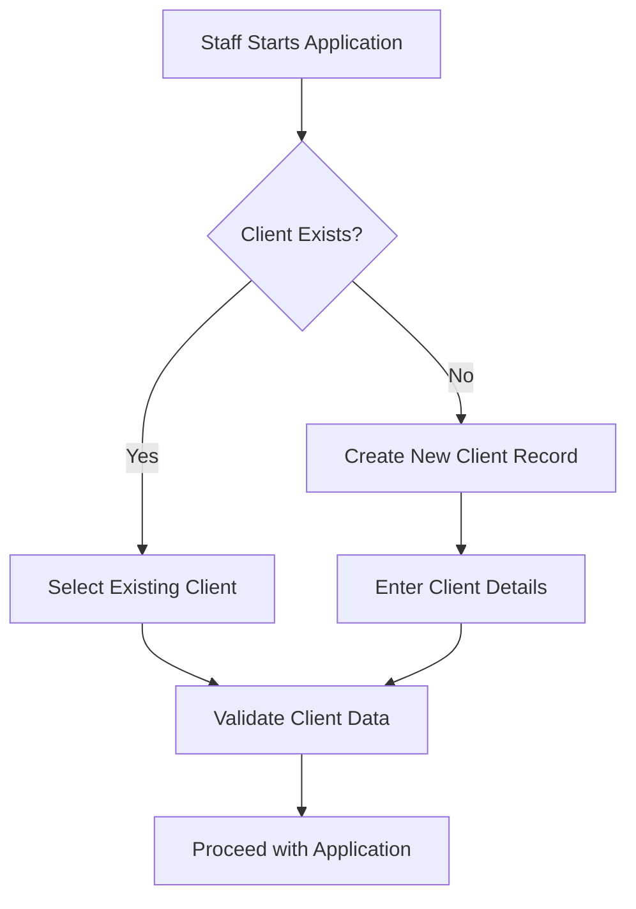

# Design Document

## Overview

This design implements a multi-role application creation system that extends the existing client-only application creation to support Manager, Junior Manager, Controller, and Call Center roles. The system maintains the existing workflow architecture while adding role-based access controls and staff-created application tracking.

The design leverages the existing workflow engine, state management, and notification systems to ensure consistency with current application processing while adding new capabilities for staff members to create applications on behalf of clients.

## Architecture

### High-Level Architecture



### Component Interaction Flow



## Components and Interfaces

### 1. Role-Based Application Creation Handler

**Purpose**: Manages application creation for different staff roles with appropriate permissions and validation.

**Key Methods**:
- `handle_role_based_creation(role, application_type, user_data)`
- `validate_role_permissions(role, application_type)`
- `create_staff_application(creator_data, client_data, application_data)`
- `track_staff_creation(creator_id, application_id, metadata)`

**Interfaces**:
```python
class RoleBasedApplicationHandler:
    async def start_application_creation(self, creator_role: str, creator_id: int, application_type: str)
    async def process_application_form(self, form_data: dict, creator_context: dict)
    async def validate_and_submit(self, application_data: dict, creator_context: dict)
    async def notify_stakeholders(self, application_id: str, creator_context: dict)
```

### 2. Permission Matrix Controller

**Purpose**: Defines and enforces role-based permissions for application creation.

**Permission Matrix**:
```python
ROLE_PERMISSIONS = {
    UserRole.MANAGER: {
        'can_create_connection': True,
        'can_create_technical': True,
        'can_assign_directly': True,
        'notification_level': 'high'
    },
    UserRole.JUNIOR_MANAGER: {
        'can_create_connection': True,
        'can_create_technical': False,
        'can_assign_directly': False,
        'notification_level': 'medium'
    },
    UserRole.CONTROLLER: {
        'can_create_connection': True,
        'can_create_technical': True,
        'can_assign_directly': True,
        'notification_level': 'high'
    },
    UserRole.CALL_CENTER: {
        'can_create_connection': True,
        'can_create_technical': True,
        'can_assign_directly': False,
        'notification_level': 'medium'
    }
}
```

### 3. Enhanced Keyboard Managers

**Purpose**: Extend existing keyboard managers to include application creation buttons for authorized roles.

**Manager Keyboard Extensions**:
```python
def get_enhanced_manager_keyboard(lang='uz'):
    # Existing buttons + new application creation buttons
    service_order_text = "🔧 Texnik xizmat yaratish" if lang == "uz" else "🔧 Создать техническую заявку"
    connection_order_text = "🔌 Ulanish arizasi yaratish" if lang == "uz" else "🔌 Создать заявку на подключение"
    
    # Add to existing keyboard structure
```

### 4. Application Creation State Management

**Purpose**: Manage FSM states for staff-created applications with role-specific flows.

**State Definitions**:
```python
class StaffApplicationStates(StatesGroup):
    selecting_client = State()
    selecting_application_type = State()
    entering_client_details = State()
    entering_application_details = State()
    confirming_application = State()
    processing_submission = State()
```

### 5. Client Selection and Validation

**Purpose**: Allow staff to select or create client records when creating applications.

**Client Selection Flow**:


### 6. Enhanced Notification System

**Purpose**: Extend existing notification system to handle staff-created applications.

**Notification Types**:
- Client notification: "Application created on your behalf"
- Staff confirmation: "Application successfully created"
- Workflow participants: "New application assigned"
- Audit notifications: "Staff application creation logged"

### 7. Audit and Tracking System

**Purpose**: Track all staff-created applications for compliance and analysis.

**Audit Data Structure**:
```python
@dataclass
class StaffApplicationAudit:
    application_id: str
    creator_id: int
    creator_role: str
    client_id: int
    application_type: str
    creation_timestamp: datetime
    client_notified: bool
    workflow_initiated: bool
    metadata: Dict[str, Any]
```

## Data Models

### Enhanced Application Model

```python
@dataclass
class EnhancedServiceRequest(ServiceRequest):
    # Existing fields from ServiceRequest
    
    # New fields for staff creation
    created_by_staff: bool = False
    staff_creator_id: Optional[int] = None
    staff_creator_role: Optional[str] = None
    client_notified_at: Optional[datetime] = None
    creation_source: str = "client"  # "client", "manager", "junior_manager", "controller", "call_center"
    
    def to_dict(self) -> Dict[str, Any]:
        base_dict = super().to_dict()
        base_dict.update({
            'created_by_staff': self.created_by_staff,
            'staff_creator_id': self.staff_creator_id,
            'staff_creator_role': self.staff_creator_role,
            'client_notified_at': self.client_notified_at,
            'creation_source': self.creation_source
        })
        return base_dict
```

### Client Selection Model

```python
@dataclass
class ClientSelectionData:
    search_method: str  # "phone", "name", "id", "new"
    search_value: Optional[str] = None
    client_id: Optional[int] = None
    new_client_data: Optional[Dict[str, Any]] = None
    verified: bool = False
```

## Error Handling

### Role Permission Errors

```python
class RolePermissionError(Exception):
    def __init__(self, role: str, action: str):
        self.role = role
        self.action = action
        super().__init__(f"Role {role} does not have permission for {action}")
```

### Client Validation Errors

```python
class ClientValidationError(Exception):
    def __init__(self, field: str, value: str, reason: str):
        self.field = field
        self.value = value
        self.reason = reason
        super().__init__(f"Client validation failed for {field}: {reason}")
```

### Application Creation Errors

```python
class ApplicationCreationError(Exception):
    def __init__(self, creator_id: int, error_type: str, details: str):
        self.creator_id = creator_id
        self.error_type = error_type
        self.details = details
        super().__init__(f"Application creation failed: {error_type} - {details}")
```

## Testing Strategy

### Unit Tests

1. **Role Permission Tests**
   - Test each role's permissions for different application types
   - Test permission denial scenarios
   - Test edge cases with invalid roles

2. **Application Creation Flow Tests**
   - Test complete application creation flow for each role
   - Test form validation and error handling
   - Test client selection and validation

3. **Notification Tests**
   - Test client notifications for staff-created applications
   - Test staff confirmation notifications
   - Test workflow participant notifications

### Integration Tests

1. **Workflow Integration Tests**
   - Test staff-created applications follow correct workflow paths
   - Test workflow state transitions
   - Test completion and feedback processes

2. **Database Integration Tests**
   - Test audit logging for staff-created applications
   - Test application retrieval and filtering
   - Test client-staff application relationships

3. **UI Integration Tests**
   - Test keyboard updates for different roles
   - Test form flow consistency across roles
   - Test error message display and handling

### End-to-End Tests

1. **Complete Application Lifecycle Tests**
   - Manager creates connection request → workflow completion
   - Call Center creates technical service → resolution
   - Junior Manager creates connection request → assignment flow

2. **Multi-Role Interaction Tests**
   - Staff creates application → Client receives notification → Workflow proceeds
   - Multiple staff members creating applications simultaneously
   - Client and staff creating applications for same client

### Performance Tests

1. **Load Testing**
   - Multiple staff members creating applications simultaneously
   - Large number of client searches and selections
   - Notification system performance under load

2. **Database Performance**
   - Application creation with audit logging
   - Client search performance with large datasets
   - Workflow state management performance

## Security Considerations

### Role-Based Access Control

- Strict validation of role permissions before allowing application creation
- Session validation to prevent role escalation
- Audit logging of all permission checks and denials

### Data Protection

- Client data protection when staff access client information
- Secure handling of client selection and validation
- Encryption of sensitive client data in audit logs

### Input Validation

- Comprehensive validation of all staff-entered data
- Sanitization of client search inputs
- Validation of application form data consistency

### Audit Trail

- Complete audit trail of all staff actions
- Immutable logging of application creation events
- Regular audit log review and analysis capabilities

## Deployment Considerations

### Database Changes

- Add new columns to existing tables for staff creation tracking
- Create audit tables for staff application creation
- Add indexes for efficient client search and application filtering

### Configuration Updates

- Update role permission configurations
- Add new notification templates for staff-created applications
- Configure audit logging levels and retention policies

### Monitoring and Alerting

- Monitor staff application creation rates and patterns
- Alert on unusual application creation activities
- Track client notification delivery success rates

### Rollback Strategy

- Ability to disable staff application creation per role
- Fallback to client-only application creation
- Data migration scripts for reverting database changes