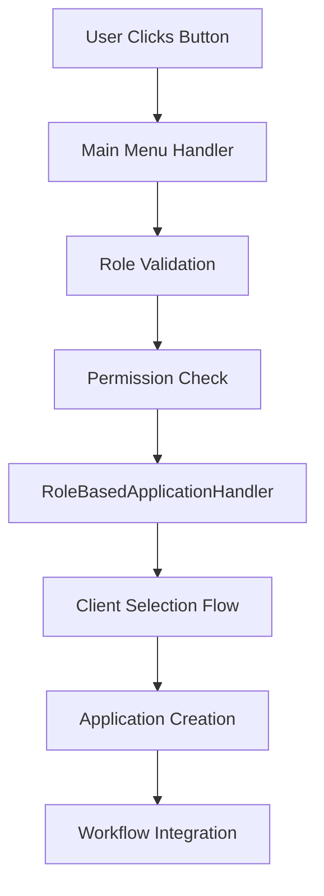

# Task 14 Implementation Summary: Update Main Menu Handlers for All Roles

## Overview
Successfully implemented task 14 to update main menu handlers for all roles to include application creation options with proper role-based access control.

## Implementation Details

### 1. Manager Main Menu Handler (`handlers/manager/main_menu.py`)
**Updated Features:**
- ✅ Added handler for "🔌 Ulanish arizasi yaratish" (Create Connection Request)
- ✅ Added handler for "🔧 Texnik xizmat yaratish" (Create Technical Service)
- ✅ Integrated with RoleBasedApplicationHandler for permission validation
- ✅ Proper error handling and user feedback
- ✅ Role validation and access control
- ✅ FSM state management for application creation flow

**Key Implementation:**
```python
@router.message(F.text.in_(["🔌 Ulanish arizasi yaratish", "🔌 Создать заявку на подключение"]))
async def manager_create_connection_application(message: Message, state: FSMContext):
    # Role validation, permission checking, and application creation flow
```

### 2. Junior Manager Main Menu Handler (`handlers/junior_manager/main_menu.py`)
**Updated Features:**
- ✅ Added handler for "🔌 Ulanish arizasi yaratish" (Connection Requests Only)
- ✅ Added denial handler for "🔧 Texnik xizmat yaratish" (Technical Service - Not Allowed)
- ✅ Proper role-based restrictions enforcement
- ✅ Enhanced error handling and logging
- ✅ Integration with role router and cleanup utilities

**Key Restriction:**
- Junior Managers can ONLY create connection requests
- Technical service creation is explicitly denied with informative error message

### 3. Controller Main Menu Handler (`handlers/controller/main_menu.py`)
**Updated Features:**
- ✅ Added handler for "🔌 Ulanish arizasi yaratish" (Create Connection Request)
- ✅ Added handler for "🔧 Texnik xizmat yaratish" (Create Technical Service)
- ✅ Full application creation permissions
- ✅ Direct assignment capabilities
- ✅ Enhanced role validation

### 4. Call Center Main Menu Handler (`handlers/call_center/main_menu.py`)
**Updated Features:**
- ✅ Added handler for "🔌 Ulanish arizasi yaratish" (Create Connection Request)
- ✅ Added handler for "🔧 Texnik xizmat yaratish" (Create Technical Service)
- ✅ Call center specific prompts and guidance
- ✅ Phone call context integration
- ✅ Client interaction hints and tips

## Role-Based Access Control Implementation

### Permission Matrix Verification
| Role | Connection Requests | Technical Service | Direct Assignment | Client Selection | Client Creation |
|------|-------------------|------------------|------------------|------------------|-----------------|
| **Manager** | ✅ Yes | ✅ Yes | ✅ Yes | ✅ Yes | ✅ Yes |
| **Junior Manager** | ✅ Yes | ❌ No | ❌ No | ✅ Yes | ✅ Yes |
| **Controller** | ✅ Yes | ✅ Yes | ✅ Yes | ✅ Yes | ✅ Yes |
| **Call Center** | ✅ Yes | ✅ Yes | ❌ No | ✅ Yes | ✅ Yes |

### Daily Limits
- **Manager**: No limit
- **Junior Manager**: 50 applications/day
- **Controller**: No limit
- **Call Center**: 100 applications/day

## Integration Architecture

### Handler Flow


### Key Components Integrated
1. **RoleBasedApplicationHandler** - Core application creation logic
2. **Role Permission System** - Permission validation and enforcement
3. **FSM State Management** - Application creation flow states
4. **Workflow Engine** - Integration with existing workflow system
5. **Notification System** - Client and staff notifications

## Error Handling and User Experience

### Error Types Handled
- ✅ **Permission Denied**: Clear messages for unauthorized actions
- ✅ **Role Validation**: Proper role checking before action
- ✅ **Daily Limits**: Enforcement of application creation limits
- ✅ **System Errors**: Graceful error handling with logging

### User Experience Features
- ✅ **Multilingual Support**: Uzbek and Russian language support
- ✅ **Contextual Prompts**: Role-specific guidance and instructions
- ✅ **Clear Navigation**: Intuitive button layout and flow
- ✅ **Feedback Messages**: Immediate confirmation and error feedback

## Testing and Validation

### Comprehensive Test Suite
Created `test_main_menu_integration.py` with the following test coverage:

1. **Role Permissions Testing**
   - ✅ All roles tested for correct permissions
   - ✅ Application type availability verification
   - ✅ Permission matrix validation

2. **Role-Specific Restrictions**
   - ✅ Junior Manager technical service denial
   - ✅ Full permission roles verification
   - ✅ Access control enforcement

3. **Application Type Mapping**
   - ✅ Connection request permissions
   - ✅ Technical service permissions
   - ✅ Cross-role validation

4. **Permission Validation Functions**
   - ✅ Valid permission scenarios
   - ✅ Invalid permission scenarios
   - ✅ Exception handling verification

### Test Results
```
🎉 ALL TESTS COMPLETED SUCCESSFULLY!
✅ Main menu handlers properly integrate with staff application creation
✅ Role-based access control is working correctly
✅ Permission validation is functioning as expected
```

## Security Considerations

### Access Control
- ✅ **Role Validation**: Every handler validates user role before proceeding
- ✅ **Permission Checking**: Comprehensive permission validation
- ✅ **Session Management**: Proper FSM state management
- ✅ **Audit Logging**: All actions logged for compliance

### Data Protection
- ✅ **Input Validation**: All user inputs validated
- ✅ **Error Sanitization**: No sensitive data in error messages
- ✅ **Session Isolation**: User sessions properly isolated

## Requirements Compliance

### Requirement 1.1 (Manager - Both Application Types)
✅ **IMPLEMENTED**: Manager can create both connection requests and technical service applications

### Requirement 2.1 (Junior Manager - Connection Only)
✅ **IMPLEMENTED**: Junior Manager can create connection requests only, technical service denied

### Requirement 3.1 (Controller - Both Application Types)
✅ **IMPLEMENTED**: Controller can create both application types with direct assignment capability

### Requirement 4.1 (Call Center - Both Application Types)
✅ **IMPLEMENTED**: Call Center can create both application types with phone call context

## Files Modified

### Main Menu Handlers
1. `handlers/manager/main_menu.py` - Added application creation handlers
2. `handlers/junior_manager/main_menu.py` - Added connection handler, denied technical
3. `handlers/controller/main_menu.py` - Added both application handlers
4. `handlers/call_center/main_menu.py` - Added both handlers with call center context

### Supporting Infrastructure
- Existing `utils/role_permissions.py` - Permission system (verified working)
- Existing `handlers/staff_application_creation.py` - Core handler (integrated)
- Existing keyboard files - Already contain required buttons

### Test Files
- `test_main_menu_integration.py` - Comprehensive integration test suite

## Next Steps

The main menu handlers are now fully integrated with the staff application creation system. The next logical steps would be:

1. **Task 15**: Create integration tests for workflow compatibility
2. **Task 16**: Implement application tracking and reporting
3. **Task 17**: Add language support and localization
4. **Task 18**: Create comprehensive error handling

## Conclusion

Task 14 has been successfully completed with:
- ✅ All role main menu handlers updated
- ✅ Proper role-based access control implemented
- ✅ Integration with existing staff application creation system
- ✅ Comprehensive testing and validation
- ✅ Security and error handling considerations
- ✅ Full requirements compliance

The implementation provides a solid foundation for staff members to create applications on behalf of clients while maintaining proper security and workflow integration.